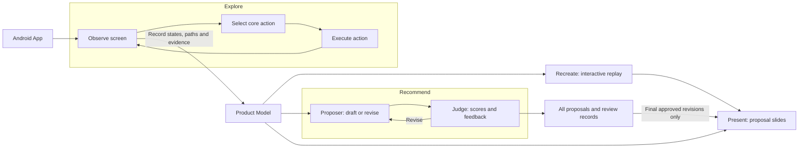
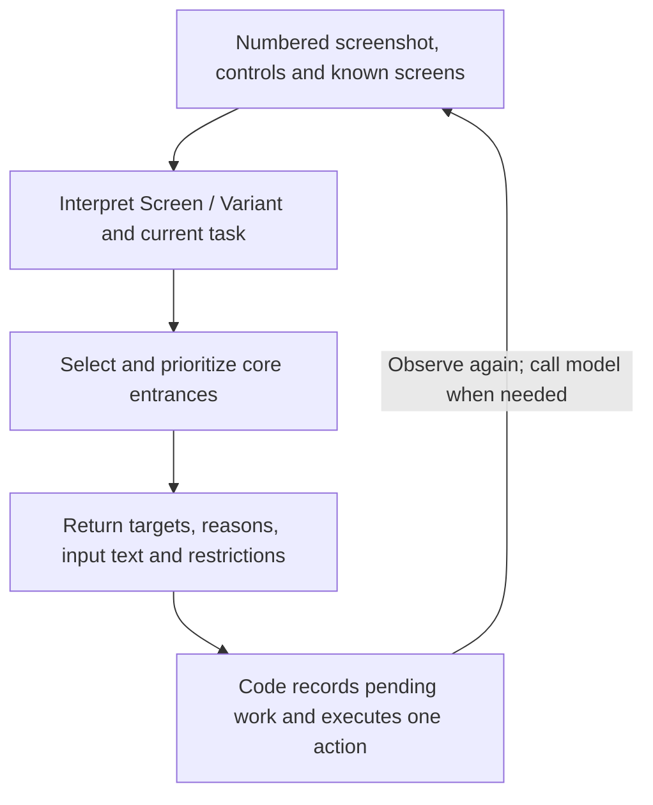
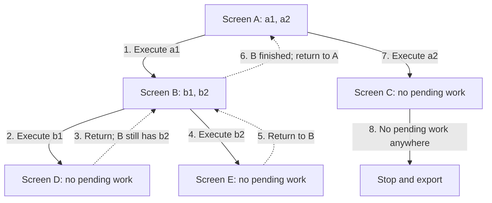
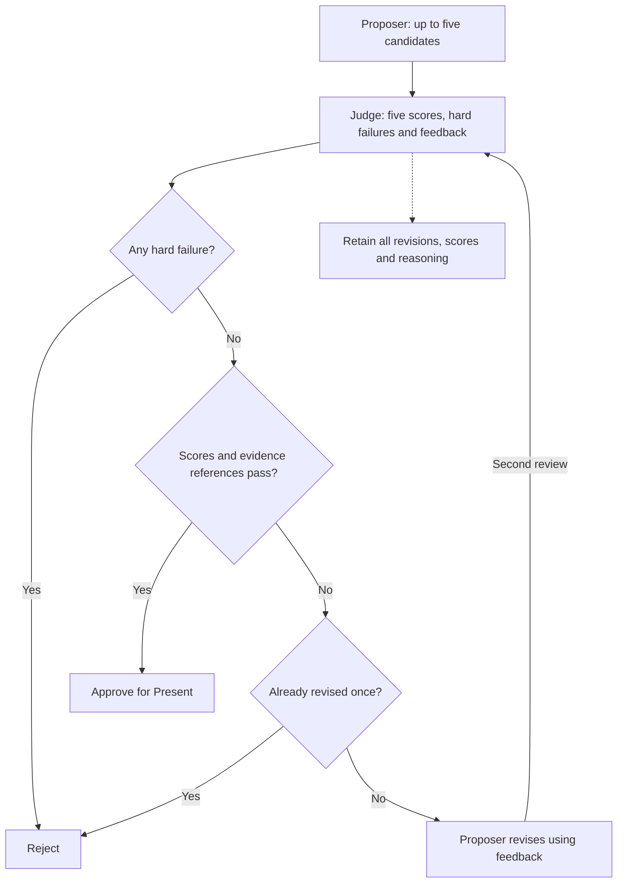

# Appraise: From App Exploration to Reviewable Rewarded-Ad Experiences

Evaluating an app's monetization opportunities usually starts with walking through its user flows: what users want to accomplish, where they encounter limits, what paid plans offer, and what value an ad reward could provide. These observations often remain scattered across screenshots and notes, making them hard to trace to a final proposal.

Appraise connects this work for product, monetization, design and engineering teams. It explores an app, records its core journeys in a Product Model, generates an interactive replay, proposes rewarded-ad experiences that fit the product and business model, and presents approved proposals as slides.

This report describes the current implementation and the gaps that remain before it can operate as an ongoing service. Examples illustrate the design; capabilities described as next steps are not yet implemented.

## 1. Two loops organize the system

- **Device exploration:** observe a screen, select an action, execute it, and observe the result. This loop builds an understanding of the product.
- **Proposal review:** generate a proposal, ask a judge to score it, and revise it when appropriate. This loop uses the product understanding to develop monetization ideas for review.



## 2. Product Model: a reusable record of observed journeys

The Product Model is a graph of product states. It records observed screen conditions, user actions and their outcomes, and serves as the shared input to Recreate, Recommend and Present.

For example, a chat product might yield the path character list → character detail → chat. Sending a message may leave the user in the same chat state, while exhausting a quota changes what they can do.

### Why distinguish Observation, Screen, Variant and State?


| Concept     | Meaning                                                                                                               | Purpose                                                           |
| ----------- | --------------------------------------------------------------------------------------------------------------------- | ----------------------------------------------------------------- |
| Observation | One observation of the app by the Explore agent: screenshot, page XML, controls, copy and foreground app information. | Preserve what was actually observed for replay and verification.  |
| Screen      | A semantic location in product navigation, such as character detail or chat.                                          | Recognize the same kind of page even when its content changes.    |
| Variant     | A condition of a Screen, such as normal use, quota exhausted or result generated.                                     | Represent differences in what users can do on the same screen.    |
| State       | One Variant of a Screen, supported by one or more Observations.                                                       | Provide a graph node linking entrances, transitions and evidence. |


Conceptually, **State = Screen + Variant**. `chat/default` and `chat/quota_exhausted` are different States. Typing another sentence in the same chat usually produces a new Observation of the same State.

Screenshots and accessibility trees serve different purposes:

- Screenshots help the model interpret visuals, icons and copy.
- The tree supplies actionable controls, identifiers and positions.
- A State summarizes these observations; screenshots and trees remain the underlying evidence.

## 3. Explore: the agent selects actions; code manages exploration

Explore aims to record the core experience. For a chat product, this may mean discovering characters, starting conversations and encountering usage limits. For a news product, it may mean browsing, reading and searching.

The agent currently infers these tasks from screen information and general prompts. It does not automatically read the Google Play description or use a human-approved journey checklist. Selecting the core experience therefore still depends on model judgment. An action budget bounds exploration but does not guarantee that the right entrances are selected.

### Agent inputs and outputs

The agent receives:

- A screenshot with numbered actionable elements.
- A list of controls.
- Known Screens and Variants.

It identifies the screen's meaning, loading status and visible monetization facts. For each new State, it proposes up to six core entrances in priority order, favoring the next step in the current user task.



The agent primarily selects `tap` and `type`; typing can include submission. The scheduler uses Back for navigation recovery.

Scrolling was initially an action, but moving through a page does not necessarily create a new State. An intermediate approach moved scrolling into observation, automatically scanning long pages and collecting long screenshots and actionable controls. The current approach, described below, scrolls to reveal specific targets. Repeated cards are sampled in the control list sent to the model so an entire feed does not become a queue of actions.

### Determining the outcome of an action

Screen stability, state identity and action effects are separate questions with separate rules.


| Question                       | Current implementation                                                                                                                                                                                                                        |
| ------------------------------ | --------------------------------------------------------------------------------------------------------------------------------------------------------------------------------------------------------------------------------------------- |
| Is the screen stable?          | Read every 300 ms. Two consecutive identical action signatures count as stable, with a 3-second limit. On timeout, use the last observation and mark it unsettled.                                                                            |
| Is this the same State?        | Within the same Activity, compare action-key sets. Reuse the State if they match exactly, or differ by at most two keys and no more than 10% of the larger set. Otherwise, ask the model. An existing Screen + Variant also reuses its State. |
| Did the action have an effect? | Compare visible control names, positions, enabled flags and extracted copy. If unchanged, wait another 1.2 seconds to confirm. If changed, determine whether the result is a change within the same State or arrival at another State.        |


### Screen-level DFS: finish a branch, then return

The scheduler first selects a pending entrance in the current State, then pending work in other States of the same Screen. After executing an entrance, it prioritizes the screen reached. When that branch has no pending work, it returns to the nearest ancestor that does.

In this example, A has entrances a1 and a2; B has b1 and b2; C, D and E have no further work. Solid arrows show exploration, dashed arrows show returns, and numbers indicate execution order.



The sequence is **A → B → D ⇢ B → E ⇢ B ⇢ A → C**.

- Reaching a leaf ends only the current branch.
- Encountering a cycle records the relationship without repeating completed entrances.
- If no ancestor has pending work, the scheduler checks other known screens.
- The tree illustrates discovery order; the saved structure is a graph.

One unresolved issue is that **returning to the same Screen does not restore the original State**. After a chat quota is consumed, the precondition for “send another message” has changed. The scheduler may still attempt an entrance from an earlier State of that Screen. This can produce an unavailable target, a disabled control, no visible effect or a different outcome; these cases do not all become `unreachable`.

### Three edge cases with implemented handling

**Loading and generation.** Code detects visible progress indicators; the model can also identify skeleton screens and generation in progress. The system checks every 3 seconds against a 90-second loading deadline. On timeout, it marks the entrance `timeout` and attempts recovery. Recognized loading states do not become product nodes. However, fast state matching can bypass model analysis, so loading detection remains incomplete.

**Offscreen targets.** Appium can expose some offscreen controls inside scroll containers. Code scrolls toward a target up to 12 times, stopping after two consecutive attempts without positional progress. Once the target is visible, the actual click frame is saved under the same State, so a screenshot of the page top is not used to explain a click farther down.

**Leaving the app or failing to return.** If the foreground package changes after an action, the system records `left_app`, marks the entrance explored, and presses Android Back. If necessary, it restarts the app and replays a known route. External destinations do not become States; their package names remain in the log. Camera, gallery and permission entrances may also be marked blocked by the model before execution. The system does not yet consistently apply a policy of continuing through prerequisites only when essential to the core task, and it has no separate detector for system dialogs within the same package. Prompts restrict unrelated settings and account actions.

These cases have handling logic, but that alone does not establish reliable device operation.

## 4. Recreate: make the observed experience inspectable

The Product Model lets someone who has not used the original app inspect its observed journeys. Each capture saves:

- An original-resolution PNG and a numbered PNG.
- Page XML and control JSON.

Recreate reads the model and its screenshot and control files, generates interaction hotspots over the original screenshots, and connects recorded actions. Scroll frames reproduce the positions visited while revealing click targets.

Delivering `product-model.json` alone is insufficient because it references image and control files by path. Include the corresponding `captures/` directory, or deliver replay HTML with embedded screenshots.

Recreate validates evidence sources, image dimensions and transition references. These structural checks are not a visual comparison and automatic correction QA loop.

## 5. Recommend: turn observations into reviewable proposals

Recommend asks: at what moment would a user willingly watch an ad, what reward would they receive, and how would they continue after declining or after an ad failure?

It reads states, paths, copy and monetization facts from the Product Model. It also accepts supplemental context with an explicit source, such as subscription prices not captured during exploration.

The Proposer and Judge currently receive text derived from the model; they do not reread the original screenshots. Errors in Explore's interpretation can therefore propagate downstream. A fact labeled `observed` comes from the model's interpretation of an observation; it has not necessarily been independently verified.

The Proposer generates up to five candidates. Each Proposal includes:

- Entry and return states, with evidence IDs.
- Reward, user choices and fulfillment.
- Decline and failure paths.
- Business impact, assumptions and a validation plan.

Proposed mechanics are distinguished from existing app behavior. Proposed screens cannot be treated as observed facts.

### What does the Judge assess, and how many revisions are allowed?


| Dimension    | Core question                                                                               | Minimum passing score |
| ------------ | ------------------------------------------------------------------------------------------- | --------------------- |
| User value   | Does the reward help with the current task and justify watching an ad?                      | 4                     |
| Context fit  | Do the entry point, timing and reward fit the journey and product experience?               | 4                     |
| Business fit | Could the offer divert users who would otherwise pay or weaken subscription value?          | 3                     |
| Feasibility  | Are fulfillment, failure handling and the return path coherent, with explicit dependencies? | 3                     |
| Evidence     | Do observations support the user need, entry point, reward value and paid-benefit claims?   | 4                     |


The Judge is instructed to identify hard failures, including:

- No clear user value, or a contradiction of observed behavior.
- An unexplained exchange or no voluntary accept/decline choice.
- Undefined reward fulfillment.
- Known in-app purchases without the pricing or entitlement information needed for business review.

The Judge identifies these semantic problems. Code enforces hard failures and score thresholds, and checks that cited evidence IDs exist.



A weak candidate without hard failures gets one revision. If it still falls short, it is rejected. Each candidate therefore receives at most one revision and two reviews within a Recommend call. A later manual rerun starts another round of work.

Zero approvals is a valid outcome. The system does not lower its thresholds to produce slides.

### How do we know the Judge is good?

There is not yet sufficient evidence. Automated tests verify score thresholds, rejection rules, revision limits and citation checks. They do not establish product understanding or commercial value. Separate Proposer and Judge calls use the same configured model and can share biases. A valid evidence ID also does not prove that the evidence supports a specific claim.

The next step is an independent evaluation:

- Ask product and monetization reviewers to label real candidates.
- Include negative examples: evidence borrowed from unrelated flows, exaggerated paid benefits and forced ad viewing.
- Calibrate the rubric on one subset of examples.
- On held-out examples, measure agreement with reviewers, false approvals, false rejections and consistency across repeated reviews.

This evaluation is not yet implemented. Passing the Judge means “worth further discussion and validation.” Reward use, paid conversion cannibalization, retention and net revenue still require product experiments.

## 6. Present: show customers how the proposal fits the product

Present reads only final approved Proposals and combines original screenshots with proposed ad experiences in three steps:

1. Existing context and reward entry point.
2. User choice and the ad.
3. Reward use and return to the task.

The slides distinguish observed screens from proposed UI and link to the interactive replay. Customers can see both the current experience and the proposed change.

The slides illustrate concepts; they do not serve ads, integrate an ad SDK or grant rewards. If no proposal passes, Present displays a page stating that no recommendation was approved.

## 7. Productionization

Here are my thoughts on this: while the system can operate in a closed loop, deploying it to a real production environment still requires a few more conditions to be met.

### How are models stored and versioned?

Stages currently communicate through files. Each Explore invocation creates a separate run:

```text
runs/<app>/<run-id>/
  graph.json                 Exploration record, state graph, observations and model usage
  product-model.json         Shared downstream data format
  explore.log               Decisions, actions and failures
  captures/                 Screenshots, XML and control files
  mock/<hash>/              Replay HTML and manifest
  recommend/<id>/           Proposals, judgments, context and manifest
  flows/<hash>/             Slides and manifest
```

For a service, a Product Model should be scoped primarily by **app package × platform × version**, with each run contributing observations. Here, free and paid experiences can usually share a model through conditions and paths. Rewarded-ad exploration can initially focus on non-subscribers, but it must still understand paid benefits to assess whether a reward weakens subscription value.

### Where should humans review?

Two review points are useful:

- **Exploration:** do selected entrances represent the core experience? Were major flows missed or irrelevant branches explored?
- **Recommendation:** does the Proposal fit the customer? Are the Judge's scores and hard failures reasonable? Feedback on the Judge should be retained separately to improve the rubric.

### What drives cost per app?

Explore repeatedly reads the device and calls a vision model, making it a larger source of model usage in the current samples. Implemented cost optimizations include:

- Focusing control lists on actionable elements.
- Sampling repeated elements.
- Avoiding model calls when a known State matches.

### How could this fit sales and integration process?

A straightforward workflow would be:

1. Identify the customer app, version and target users.
2. Run Explore, then run Recommend with a customer context file describing the target users, business goals, confirmed pricing and entitlements, and constraints. I built this feature because context is so crucial for proposer agent. We could even pull in things like the Google Play description, screenshots, and pricing model.

```bash
bun recommend --app luzia --run <run-id> --context ./client-context.md
```

3. Have product or sales staff review proposals and judgments, update the context when needed, and rerun Recommend.
4. Deliver slides and replay through a standard sales template.
5. After the customer agrees on a direction, have engineering assess ad integration, reward fulfillment, instrumentation and experiments.

## 8. Limitations and next steps

Current samples cover parts of Janitor, Luzia and AOL and produce replay and proposal artifacts. Early OOC emulator attempts did not reach the core experience. These samples demonstrate that the pipeline can run. They do not establish complete journey coverage, reliable backtracking or commercially effective recommendations.

The next priorities are:

- **Narrowed exploration scope:** Since Explore mode already covers the product’s core experience, focus the next iteration on a single user journey—for example, entering the app and completing two rounds of dialogue. This provides a clear termination condition and concrete tasks without the complexity of DFS and scheduling.
- **Exploration correctness:** Align action preconditions with `State`, reduce irrelevant entry points, prevent repeated exploration and incorrect state merges, and support controlled media/permission steps with resume functionality.
- **Evaluation:** Build a set of human-confirmed core tasks and measure task completion, missed key entry points, incorrect merges, repeated actions, and backtracking success. Add an independent Judge evaluation afterward.

