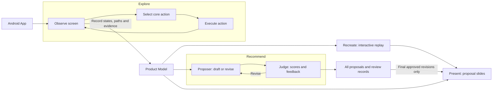
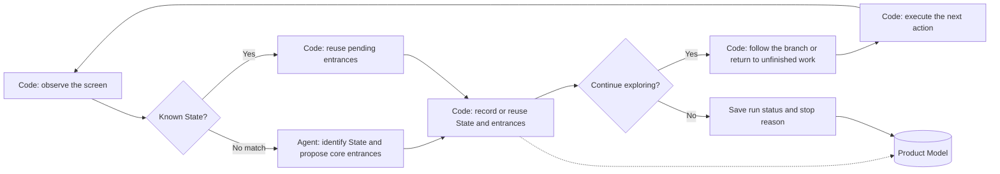
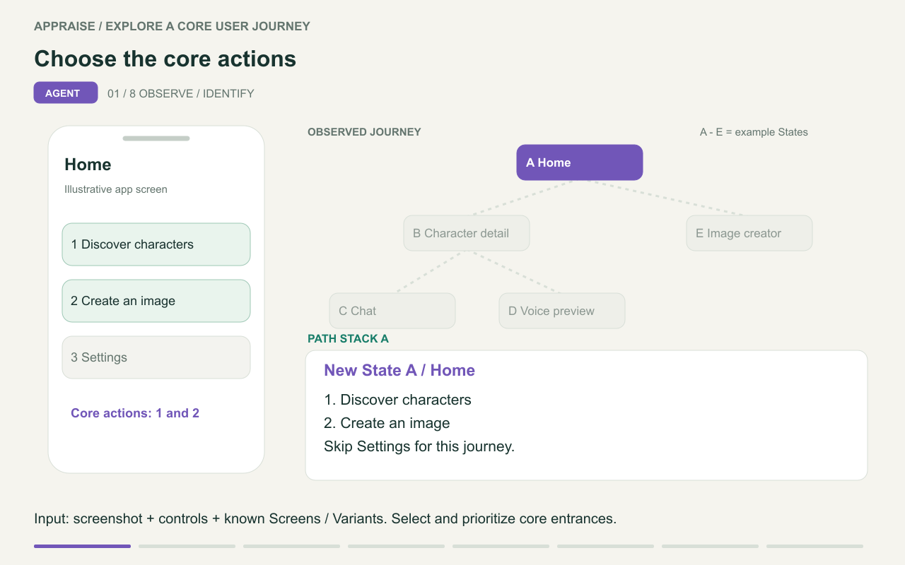
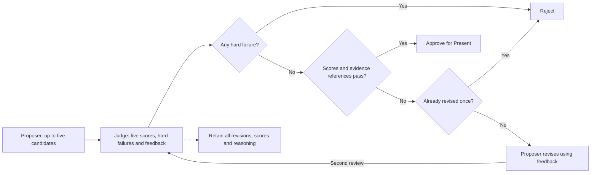
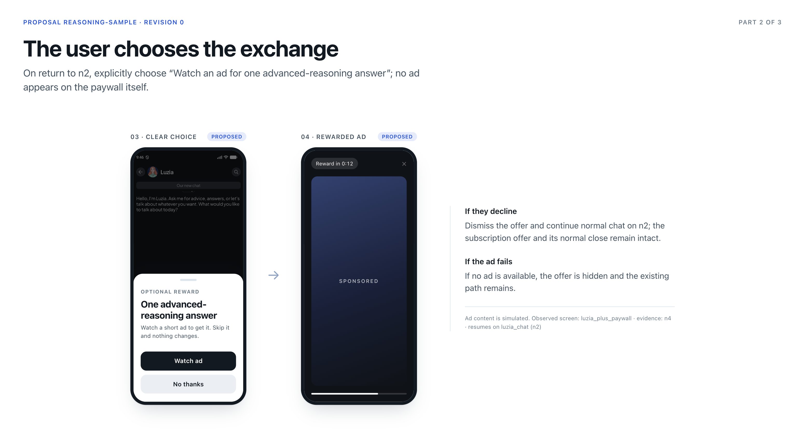

# Appraise: From App Exploration to Reviewable Rewarded-Ad Experiences

Evaluating an app's monetization opportunities usually starts with walking through its user flows: what users want to accomplish, where they encounter limits, what paid plans offer, and what value an ad reward could provide. These observations often remain scattered across screenshots and notes, making them hard to trace to a final proposal.

Appraise connects this work for product, monetization, design and engineering teams. It explores an app, records its core journeys in a Product Model, generates an interactive replay, proposes rewarded-ad experiences that fit the product and business model, and presents approved proposals as slides.

This report describes the current implementation and the gaps that remain before it can operate as an ongoing service. Examples illustrate the design; capabilities described as next steps are not yet implemented.

## 1. Two loops organize the system

- **Device exploration:** observe a screen, select an action, execute it, and observe the result. This loop builds an understanding of the product.
- **Proposal review:** generate a proposal, ask a judge to score it, and revise it when appropriate. This loop uses the product understanding to develop monetization ideas for review.



## 2. Product Model: a reusable record of observed journeys

The Product Model is a graph of product states. It records observed screen conditions, user actions and their outcomes, and serves as the shared input to Recreate, Recommend and Present.

For example, a chat product might yield the path character list → character detail → chat. Sending a message may leave the user in the same chat state, while exhausting a quota changes what they can do.

### Why distinguish State, Screen, Variant and Observation?


| Concept     | Meaning                                                                                                               | Purpose                                                           |
| ----------- | --------------------------------------------------------------------------------------------------------------------- | ----------------------------------------------------------------- |
| State       | A Screen + Variant combination, supported by one or more Observations.                                                | Provide a graph node linking entrances, transitions and evidence. |
| Screen      | A semantic location in product navigation, such as character detail or chat.                                          | Recognize the same kind of page even when its content changes.    |
| Variant     | A condition of a Screen, such as normal use, quota exhausted or result generated.                                     | Represent differences in what users can do on the same screen.    |
| Observation | One observation of a State by the Explore agent: screenshot, page XML, controls, copy and foreground app information. | Preserve what was actually observed for replay and verification.  |


Conceptually, **State = Screen + Variant**, and an **Observation records a State at a particular moment**. A State can have multiple Observations. `chat/default` and `chat/quota_exhausted` are different States, e.g. typing another sentence in the same chat usually produces a new Observation of the same State.

Screenshots and accessibility trees serve different purposes:

- Screenshots help the model interpret visuals, icons and copy.
- The tree supplies actionable controls, identifiers and positions.

## 3. Explore: the agent selects actions; code manages exploration

**Explore simulates an app's core user journeys and records them in the Product Model**.

- The agent interprets screens and selects interactions that advance the app's main experience
- Code executes those interactions, tracks progress, and manages navigation.

The explorer follows one branch at a time, returning to unfinished entrances as needed. Each step contributes observations and action results to the recorded graph.

The process has four parts: identifying the current State and its core entrances, executing an action and observing its result, choosing where to explore next, and deciding when to stop.



### 1. Identify the State and select core entrances

A **core entrance** is an interaction selected to advance the app's main user experience, such as opening a character or sending a message. The agent infers the user's likely task from the screen and its instructions. It does not receive a predefined journey or completion checklist, and generally excludes unrelated actions such as opening Settings.

Code first checks whether the observation matches a known State. If it does, the explorer resumes unfinished actions and saves the latest observation. Otherwise, it asks the agent to identify the State using the app name, Android Activity and three inputs:

- **A numbered screenshot** showing tappable controls in red, text inputs in blue, and disabled controls in gray.
- **A matching control list** with each element's number, action, label, Android details and status. Repeated cards are sampled to keep the list manageable.
- **A catalog of known Screens and Variants** to distinguish familiar screens and conditions from new ones.

For a new State, the agent proposes up to ++six++ core entrances in priority order, including targets, reasons, input text and execution restrictions. If it identifies a known State, the explorer keeps that State's existing entrances.

### 2. Execute an action and observe the result

Code executes the selected `tap` or `type` action; typing can include submission. If the target is offscreen, code scrolls to reveal it and saves the actual interaction frame as another Observation of the same State.

This is one reason for using Appium: its UI hierarchy can expose some offscreen controls, allowing the agent to choose targets beyond the current screenshot.

After an action, the explorer checks the result:


| Question                       | How it is checked                                                                               |
| ------------------------------ | ----------------------------------------------------------------------------------------------- |
| Is the screen stable?          | Wait briefly for the controls to stop changing before recording an observation.                 |
| Did the action have an effect? | Compare the page before and after the action. If nothing changes, wait briefly and check again. |


The resulting observation goes through State identification again. If the action leaves the app, or navigation fails to return to the target screen, code tries Back first. If needed, it restarts the app and follows a recorded route.

### 3. Follow a branch, then return

**The explorer follows one core journey at a time**. After taking an action, it continues with pending actions on the screen reached. When no pending actions remain there, it returns to the nearest screen on its navigation path with unfinished work. If none exists on that path, it checks other known screens.

Within a Screen, the scheduler prioritizes entrances from the current State, then considers pending entrances recorded in other States of that Screen.



The sequence is **A → B → C ⇢ B → D ⇢ B ⇢ A → E**: finish the chat and voice branches before returning Home to create an image.

The navigation path acts as a stack for **depth-first exploration**. Completed entrances are not repeated when a cycle returns to a known State, and the saved structure remains a graph. **However, returning to a Screen does not restore its earlier State; this limitation is discussed in Section 8.**

### 4. Stop and record the outcome

The run ends when all discovered entrances have been explored, the remaining work is blocked, the action budget is exhausted, or an unrecovered error occurs. It records the run status and reason for stopping alongside the observed journey.

Completing exploration does not guarantee full-app coverage or successful completion of a user's task.

## 4. Recreate: make the observed experience inspectable

Recreate builds an interactive mock app from the Product Model, screenshots and control files, reproducing the original app's observed core journeys. It places interaction hotspots over the original screenshots and connects recorded actions. Scroll frames reproduce the positions visited while revealing click targets.

[https://github.com/user-attachments/assets/364c7662-0cf7-4533-b16e-38dc7eeacf36](https://github.com/user-attachments/assets/364c7662-0cf7-4533-b16e-38dc7eeacf36)

### Mock quality

Mock quality should be assessed along three dimensions:


| Dimension                        | What to assess                                                                              |
| -------------------------------- | ------------------------------------------------------------------------------------------- |
| Flow accuracy                    | Does each State–action–result relationship match the original app?                          |
| Journey relevance and redundancy | Do the selected entrances represent core journeys without repeating equivalent experiences? |
| Interaction fidelity             | Do hotspots, scrolling and transitions faithfully reproduce the recorded interactions?      |


We’re still considering how to design a suitable QA loop to improve mock quality. One idea is to introduce a human-in-the-loop feedback process, which may be the next step. The current thoughts are:

- **Sample equivalent entrances**, while still representing distinct behaviors and monetization conditions. For example, if several characters follow the same chat flow, one representative entrance may be enough. A paid character with different access conditions should be explored separately.
- **Feed incorrect flows and redundant branches back into Explore** to improve the exploration logic.
- **Correct hotspot placement and playback errors in Recreate**, such as adjusting tap locations or fixing replay behavior.

## 5. Recommend: turn observations into reviewable proposals

Recommend uses the Product Model and optional business context to propose rewarded-ad experiences: where to offer an ad, what the user receives, and how they continue afterward.

The Proposer generates up to five candidates for Judge review. Each describes the entry point, reward, user choice, fulfillment and return paths, with supporting evidence and business assumptions.

### What does the Judge assess, and how many revisions are allowed?


| Dimension    | Core question                                                                               |
| ------------ | ------------------------------------------------------------------------------------------- |
| User value   | Does the reward help with the current task and justify watching an ad?                      |
| Context fit  | Do the entry point, timing and reward fit the journey and product experience?               |
| Business fit | Could the offer divert users who would otherwise pay or weaken subscription value?          |
| Feasibility  | Are fulfillment, failure handling and the return path coherent, with explicit dependencies? |
| Evidence     | Do observations support the user need, entry point, reward value and paid-benefit claims?   |


The Judge is instructed to identify hard failures, including:

- No clear user value, or a contradiction of observed behavior.
- An unexplained exchange or no voluntary accept/decline choice.
- Undefined reward fulfillment.
- Known in-app purchases without the pricing or entitlement information needed for business review.



A weak candidate without hard failures gets one revision. If it still falls short, it is rejected. Each candidate therefore receives at most one revision and two reviews within a Recommend call. 

### How do we know the Judge is good?

The point is that the **Judge has not yet been independently validated**, so a human should review its judgments before pushing to production. The next step is to conduct an independent evaluation:

- Include negative examples: evidence borrowed from unrelated flows, exaggerated paid benefits and forced ad viewing.
- Calibrate the rubric on one subset of examples. Use a sample to check whether the Judge’s ratings match human expectations, then refine the rubric and test it on other examples.

## 6. Present: show customers how the proposal fits the product

Present reads only final approved Proposals and combines original screenshots with proposed ad experiences in three steps:

1. Existing context and reward entry point.
2. User choice and the ad.
3. Reward use and return to the task.



## 7. Productionization

Here are my thoughts on this: while the system can operate in a closed loop, deploying it to a real production environment still requires a few more conditions to be met.

### How are models stored and versioned?

Stages currently communicate through files. Each Explore invocation creates a separate run:

```text
runs/<app>/<run-id>/
  graph.json                 Exploration record, state graph, observations and model usage
  product-model.json         Shared downstream data format
  explore.log               Decisions, actions and failures
  captures/                 Screenshots, XML and control files
  mock/<hash>/              Replay HTML and manifest
  recommend/<id>/           Proposals, judgments, context and manifest
  flows/<hash>/             Slides and manifest
```

For a service, a Product Model should be scoped primarily by **app package × platform × version**, with each run contributing observations. Here, free and paid experiences can usually share a model through conditions and paths. Rewarded-ad exploration can initially focus on non-subscribers, but it must still understand paid benefits to assess whether a reward weakens subscription value.

### Where should humans review?

Two review points are useful:

- **Exploration:** do selected entrances represent the core experience? Were major flows missed or irrelevant branches explored?
- **Recommendation:** does the Proposal fit the customer? Are the Judge's scores and hard failures reasonable? Feedback on the Judge should be retained separately to improve the rubric.

### What drives cost per app?

Explore repeatedly reads the device and calls a vision model, making it a larger source of model usage in the current samples. Implemented cost optimizations include:

- Focusing control lists on actionable elements.
- Sampling repeated elements.
- Avoiding model calls when a known State matches.

### How could this fit sales and integration process?

A straightforward workflow would be:

1. Identify the customer app, version and target users.
2. Run Explore, then run Recommend with a customer context file describing the target users, business goals, confirmed pricing and entitlements, and constraints. I built this feature because context is so crucial for proposer agent. We could even pull in things like the Google Play description, screenshots, and pricing model.

```bash
bun recommend --app luzia --run <run-id> --context ./client-context.md
```

3. Have product or sales staff review proposals and judgments, update the context when needed, and rerun Recommend.
4. Deliver slides and replay through a standard sales template.
5. After the customer agrees on a direction, have engineering assess ad integration, reward fulfillment, instrumentation and experiments.

## 8. Limitations and next steps

### What has been demonstrated

Runs on parts of Janitor, Luzia and AOL have produced replay and proposal artifacts. Early OOC emulator attempts did not reach the core experience.

### Main limitations


| Limitation                                                                                              | Impact                                                                                                                             |
| ------------------------------------------------------------------------------------------------------- | ---------------------------------------------------------------------------------------------------------------------------------- |
| Returning to a Screen does not restore its earlier State.                                               | The scheduler may attempt actions whose preconditions no longer hold, such as sending a message after the chat quota is exhausted. |
| Loading detection, system dialogs, and required media or permission steps are not handled consistently. | Core journeys may be interrupted or left incomplete.                                                                               |
| Proposer and Judge read text from the Product Model without rechecking the screenshots.                 | Explore's interpretation errors can propagate into proposals and reviews; `observed` does not mean independently verified.         |


### Next priorities

1. **Define one bounded core journey.** Focus the next iteration on a concrete task, such as entering the app and completing two rounds of dialogue. Specify the starting conditions and completion criteria so exploration has an explicit endpoint and depends less on general DFS scheduling (Current DFS implementation might be a bit over engineering :(
2. **Make that journey reliable.** Reduce irrelevant or repeated entrances and support controlled media and permission steps with resumption. Verify each State–action–result relationship against the original app
3. **Evaluate before broadening scope.** Use human-confirmed tasks to measure completion, missed core entrances, incorrect merges, repeated actions and backtracking success. Then independently evaluate the Judge against product and monetization reviewers.

